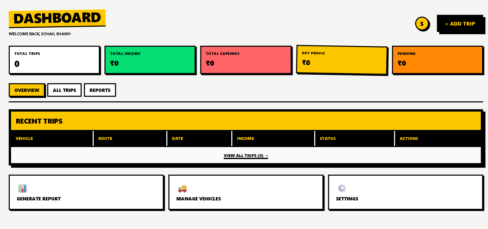
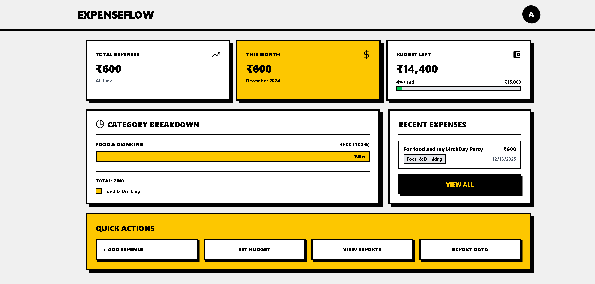

# 💰 ExpenseFlow - Dual-Mode Expense Tracker

<div align="center">


**A modern, full-stack expense tracking application with dual-mode functionality for both transport businesses and personal expense management.**

[](https://nodejs.org/)
[](https://reactjs.org/)
[](https://www.mongodb.com/)

[Live Demo](#) | [Report Bug](#) | [Request Feature](#)

</div>

---

## 📸 Screenshots

<div align="center">

### 🏠 Landing Page


### 💼 Transport Expense Dashboard


### 🧾 Personal Expense Dashboard


</div>

---

## ✨ Features

### 🎯 Core Features
- **🔐 Secure Authentication** - JWT-based auth with httpOnly cookies
- **👥 Dual User Modes** - Choose between Transport Business or Personal tracking
- **📊 Real-time Analytics** - Dynamic dashboards with category breakdowns
- **💳 Payment Integration** - Razorpay payment gateway for donations/subscriptions
- **📱 Responsive Design** - Brutalist UI that works on all devices
- **☁️ Cloud Storage** - Receipt uploads via Cloudinary

### 🚛 Transport Mode Features
- Trip expense tracking with detailed breakdowns
- Fuel, maintenance, and toll management
- Trip-wise profit/loss calculation
- Receipt upload for each trip
- Date range filtering

### 🧾 Personal Mode Features
- Daily expense tracking across 11+ categories
- Budget management with visual progress bars
- Monthly spending analytics
- Recurring expense support
- Tag-based organization
- Payment method tracking (Cash, UPI, Card, etc.)

### 🔒 Security Features
- Password hashing with bcrypt
- JWT token authentication
- HTTP-only cookies
- CORS protection
- Input validation with express-validator
- Multi-tenant data isolation

---

## 🛠️ Tech Stack

### Backend


- **Runtime**: Node.js v18+
- **Framework**: Express.js v5
- **Database**: MongoDB with Mongoose ODM
- **Authentication**: JSON Web Tokens (JWT)
- **Payment**: Razorpay
- **Storage**: Cloudinary
- **Email**: Nodemailer
- **Validation**: express-validator

### Frontend


- **Library**: React 19.2
- **Build Tool**: Vite
- **Styling**: TailwindCSS v4 (Brutalist Design)
- **Routing**: React Router v7
- **State**: Context API
- **HTTP Client**: Axios
- **Charts**: Recharts
- **Icons**: React Icons, Lucide React

---

## 🚀 Quick Start

### Prerequisites
- Node.js v18 or higher
- MongoDB (local or Atlas)
- npm or yarn

### Installation

1. **Clone the repository**
```bash
git clone https://github.com/yourusername/expense-tracker-transport.git
cd expense-tracker-transport
```

2. **Backend Setup**
```bash
cd Backend
npm install
```

Create `.env` file in Backend directory:
```env
# Server
PORT=8000
NODE_ENV=development

# Database
MONGODB_URI=mongodb://localhost:27017/expenseflow
# Or MongoDB Atlas:
# MONGODB_URI=mongodb+srv://<username>:<password>@cluster.mongodb.net/expenseflow

# JWT
JWT_SECRET=your_super_secret_jwt_key_here

# Cloudinary
CLOUDINARY_CLOUD_NAME=your_cloud_name
CLOUDINARY_API_KEY=your_api_key
CLOUDINARY_API_SECRET=your_api_secret

# Email (Nodemailer)
SENDER_EMAIL=your_email@gmail.com
EMAIL_PASSWORD=your_app_password

# Razorpay
RAZORPAY_KEY_ID=your_razorpay_key_id
RAZORPAY_KEY_SECRET=your_razorpay_secret

# Frontend URLs
LOCALFRONTEND=http://localhost:5173
FRONTEND=https://your-deployed-frontend.vercel.app
```

Start backend server:
```bash
npm run dev
```

3. **Frontend Setup**
```bash
cd Frontend
npm install
```

Create `.env` file in Frontend directory:
```env
VITE_API_URL=http://localhost:8000
VITE_RAZORPAY_KEY_ID=your_razorpay_key_id
```

Start frontend:
```bash
npm run dev
```

4. **Access the application**
- Frontend: http://localhost:5173
- Backend: http://localhost:8000

---

## 📁 Project Structure

```
Expense-Tracker-Transport/
├── Backend/
│   ├── config/
│   │   ├── EmailTemplate.js
│   │   ├── nodeMailer.js
│   │   └── Razorpay.js
│   ├── controllers/
│   │   ├── budget.controllers.js
│   │   ├── expense.controllers.js
│   │   ├── razorpay.controllers.js
│   │   ├── trip.controllers.js
│   │   └── user.controllers.js
│   ├── DB/
│   │   └── Db.js
│   ├── middleware/
│   │   └── auth.js
│   ├── model/
│   │   ├── budget.model.js
│   │   ├── expense.model.js
│   │   ├── razorpay.model.js
│   │   ├── tripeExpenses.js
│   │   └── user.model.js
│   ├── routes/
│   │   ├── budget.route.js
│   │   ├── expense.route.js
│   │   ├── razorpay.Route.js
│   │   ├── trip.routes.js
│   │   └── user.routes.js
│   ├── utils/
│   │   ├── cloudinary.js
│   │   └── jsonAuth.js
│   ├── app.js
│   ├── server.js
│   └── package.json
│
└── Frontend/
    ├── Expense/
    │   ├── AddExpense.jsx
    │   ├── Budget.jsx
    │   └── ExpenseDasboard.jsx
    ├── src/
    │   ├── Components/
    │   │   ├── Footer.jsx
    │   │   ├── Header.jsx
    │   │   └── Hero.jsx
    │   ├── config/
    │   │   └── Axios.js
    │   ├── context/
    │   │   ├── AuthContext.jsx
    │   │   ├── razorpayContext.jsx
    │   │   ├── SimpleExpenseContext.jsx
    │   │   └── TripContext.jsx
    │   ├── pages/
    │   │   ├── AddTrip.jsx
    │   │   ├── Dashboard.jsx
    │   │   ├── EditTrip.jsx
    │   │   ├── ForgotPage.jsx
    │   │   ├── Home.jsx
    │   │   ├── Login.jsx
    │   │   ├── SignUp.jsx
    │   │   └── View.jsx
    │   ├── routes/
    │   │   ├── AppRoutes.jsx
    │   │   └── ProtectedRoute.jsx
    │   ├── App.jsx
    │   └── main.jsx
    └── package.json
```

---

## 🔑 API Endpoints

### Authentication
```
POST   /user/register          - Create new account
POST   /user/login             - User login
POST   /user/logout            - User logout
GET    /user/getCurrentUser    - Get authenticated user
POST   /user/reset-otp         - Request password reset OTP
POST   /user/reset-password    - Reset password with OTP
```

### Trip Expenses (Transport Mode)
```
POST   /trip/create            - Create new trip
GET    /trip/getAllTrips       - Get all user trips
GET    /trip/:id               - Get single trip details
PUT    /trip/update/:id        - Update trip
DELETE /trip/delete/:id        - Delete trip
```

### Personal Expenses (Simple Mode)
```
POST   /expense/               - Create expense
GET    /expense/               - Get all expenses (with filters)
GET    /expense/statistics     - Get spending analytics
GET    /expense/:id            - Get single expense
PUT    /expense/:id            - Update expense
DELETE /expense/:id            - Delete expense
```

### Budget Management
```
POST   /budget/addBudget       - Create budget
GET    /budget/getAllBudget    - Get all budgets
```

### Payment (Razorpay)
```
POST   /razorpay/create-order  - Create payment order
POST   /razorpay/verify        - Verify payment signature
GET    /razorpay/supporters    - Get supporters list
```

---

## 🎨 Design Philosophy

ExpenseFlow uses a **Brutalist Design** approach:
- **Bold Typography** - Thick, uppercase fonts for maximum impact
- **Strong Borders** - 4-8px black borders on all elements
- **Harsh Shadows** - Drop shadows for depth
- **Limited Colors** - Yellow, black, and white palette
- **No Gradients** - Flat, solid colors only
- **Sharp Corners** - No border-radius
- **Maximum Contrast** - Easy readability

---

## 🔐 Environment Variables

### Backend (.env)
| Variable | Description | Required |
|----------|-------------|----------|
| `PORT` | Server port | Yes |
| `MONGODB_URI` | MongoDB connection string | Yes |
| `JWT_SECRET` | Secret key for JWT tokens | Yes |
| `CLOUDINARY_CLOUD_NAME` | Cloudinary cloud name | Yes |
| `CLOUDINARY_API_KEY` | Cloudinary API key | Yes |
| `CLOUDINARY_API_SECRET` | Cloudinary API secret | Yes |
| `SENDER_EMAIL` | Email for sending OTPs | Yes |
| `EMAIL_PASSWORD` | Email app password | Yes |
| `RAZORPAY_KEY_ID` | Razorpay key ID | Yes |
| `RAZORPAY_KEY_SECRET` | Razorpay secret | Yes |
| `LOCALFRONTEND` | Local frontend URL | Yes |
| `FRONTEND` | Production frontend URL | No |

### Frontend (.env)
| Variable | Description | Required |
|----------|-------------|----------|
| `VITE_API_URL` | Backend API URL | Yes |
| `VITE_RAZORPAY_KEY_ID` | Razorpay public key | Yes |

---

## 🧪 Testing

```bash
# Backend tests (coming soon)
cd Backend
npm test

# Frontend tests (coming soon)
cd Frontend
npm test
```

---

## 📦 Deployment

### Backend (Render/Railway/Heroku)
1. Push code to GitHub
2. Connect repository to Render/Railway
3. Add environment variables
4. Deploy

### Frontend (Vercel/Netlify)
1. Push code to GitHub
2. Connect repository to Vercel
3. Add environment variables
4. Deploy

---

## 🤝 Contributing

Contributions are welcome! Please follow these steps:

1. Fork the repository
2. Create a feature branch (`git checkout -b feature/AmazingFeature`)
3. Commit your changes (`git commit -m 'Add some AmazingFeature'`)
4. Push to the branch (`git push origin feature/AmazingFeature`)
5. Open a Pull Request

---


## 🙏 Acknowledgments

- Icons from [React Icons](https://react-icons.github.io/react-icons/)
- Charts from [Recharts](https://recharts.org/)
- Payment gateway by [Razorpay](https://razorpay.com/)

---

## 📚 Future Enhancements

- [ ] Receipt OCR with Google Gemini AI
- [ ] Dark mode support
- [ ] Export to CSV/PDF
- [ ] Multi-currency support
- [ ] Mobile app (React Native)
- [ ] Expense sharing with friends/family
- [ ] Budget recommendations with AI
- [ ] Recurring expense automation
- [ ] Bank account integration
- [ ] Tax calculation and reports

---

<div align="center">

**⭐ Star this repo if you find it helpful!**

</div>